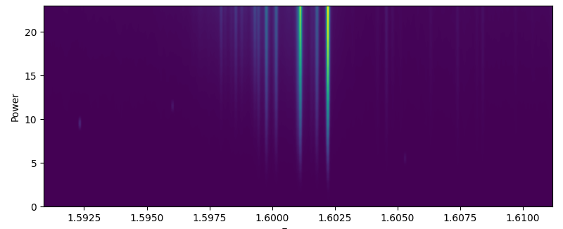
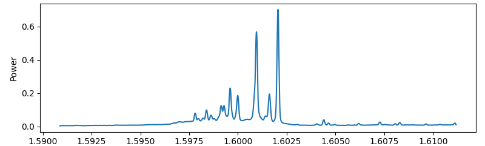

# Archive: Feature Extraction with Parametric Physics based modelling

_Note: This is a work in progress. This initial approach was ideated by Eoin, it
may not be the best course of action. Any reader is encouraged to critique the
approach and suggest improvements or alternate approaches._
  
>  _Figure: Heatmap of power dependance, we
> vary the input laser power and collectd spectrum at each power level to build
> the heatmap. The x-axis is energy, the y-axis is laser power and the z-axis is
> intensity collected on the spectrometer._

Let's start by defining our heatmap datatype. We will call the intensity profile of the
heatmap ${tex`I`}, with a shape of 23x2046. This shape is lab-defined, with 23
steps for varying power dependence and 2046 steps on the energy axis. While many
data samples share a common energy axis, not all do.

>  _Figure: Spectrum, we can see clearly
> many sharp peaks coresponding to states in the QD._


Our goal is to define an extraction mapping E from the matrix I to a matrix P
which reduces the dimensionality but retains as much information as possible.

```tex
E: \bold{I}^{m \times n} \to \bold{P}^{i \times j}, \quad \text{where } i < m \text{ and } j < n
```

where m = 23 and n = 2046.

Our initial idea for feature extraction involves fitting a Gaussian profile to
each peak in the heatmap. From this, we can extract each peak's center point,
full width at half maximum (FWHM), amplitude, power dependence characteristic
slope, and the power at which the peak first appears. Thus the contents of the
matrix `P` contain the extracted parameters.

We intend to attempt to fit to the entire heatmap in one steps, and thus need to
define a fitting function F per peak, we do this by taking a gaussian along x and a sigmoid along y and multiplying both to get F.

<div class="card">

<div class="grid grid-cols-2"><div>

## Gaussian along the energy x-axis

```tex
X(x, x_0, w) =  e^{\frac{-((x-x_0)^2)}{2w^2}}
```

Here we create an interactive playground to understand this function

```ts
const energies = d3.range(0, 100)
const x_0 = view(Inputs.range([0, d3.max(energies)], {step: 0.01, value: d3.max(energies)/2 , label:"x_0"}));
const w = view(Inputs.range([0.1, 20], {step: 0.01, value: 10.0, label:"w"}));
```

</div><div>

```ts

const X = (x, x_0, w) =>  Math.exp(-((x-x_0)**2) / (2*w**2))
const data = energies.map((x) => {return {x,y: X(x, x_0, w)}}).flat()

display(Plot.plot({
  marks: [
    Plot.line(data, { x: 'x', y: 'y' })
  ],
  x: { domain: [0, d3.max(energies)] },
  y: { domain: [0, 1] },
}))
```
</div></div></div>

<div class="card">

<div class="grid grid-cols-2"><div>

## Sigmoid along the power y-axis

```tex
Y(y, y_0, s, A) =  \frac{A(y-y_0)^s}{ 1 + (y-y_0)^s }
```

Here we create an interactive playground to understand this function


```ts
const y_0 = view(Inputs.range([0, 10], {step: 0.1, value: 0, label:"y_0"}));
const s = view(Inputs.range([0, 5], {step: 0.01, value: 1.1 , label:"s"}));
const A = view(Inputs.range([0, 1], {step: 0.01, value: 1, label:"A"}));
```

</div><div>

```ts
const powers = d3.range(0, 10, 0.1)
const Y = (y, y_0, s, A) =>  A * ((y - y_0)**s) /(1 + (y-y_0)**s)
const data = powers.map((x) => {return {x, y: Y(x, y_0, s, A)}}).flat()

display(Plot.plot({
  marks: [
    Plot.line(data, { x: 'x', y: 'y' })
  ],
  y: {domain: [0, 1]}
}))
```

</div></div></div>

We can then combine these two functions into our fitting function F

```tex
F(x, y, x_0, w, y_0, s, A) = X \times Y  =   e^{\frac{-((x-x_0)^2)}{2w^2}} \times \frac{A(y-y_0)^s}{ 1 + (y-y_0)^s }
```

This neatly creates a 2D heatmap of one peak.

```ts
const peak = (x, y, params) => {
  const x_0 = params[0]
  const w = params[1]
  const y_0 = params[2]
  const s = params[3]
  const A = params[4]

  return {x,y,z: X(x, x_0, w) * Y(y, y_0, s, A) || 0,}
}

const data = powers.map((p) => {return energies.map(e => {return peak(e, p, [x_0, w, y_0, s, A])})}).flat()

display(Plot.plot({
  marks: [
    Plot.rect(data, { x: 'x', y: 'y', fill: 'z' })
  ],
  padding: 0,
  height: 200,
  x: {tickSize: 0,ticks: 0.01,tickRotate: 0,tickFormat: (d, i) => '',},
  y: {labelOffset: 50,reverse: true,tickSize: 0,ticks: 0.01,tickRotate: 0,tickFormat: (d, i) => '',},
  z: {domain: [0, 1]}
}))
```

The idea then becomes to extract the five parameters

```tex
x_0, w, y_0, s, A
```

For each peak in the heatmap, assuming a maximum of 20 peaks we then have 100 parameters per heatmaps instead of 23x2046.

## Other approaches

Other approaches that could be investigated:

1. Principal component analysis could be used for dimensionality reduction, but
Eoin needs to understand better what this means.
2. A small autoencoder could be trained on the 50 initial pieces of data, then
the VAE could be sampled to create more data pieces.