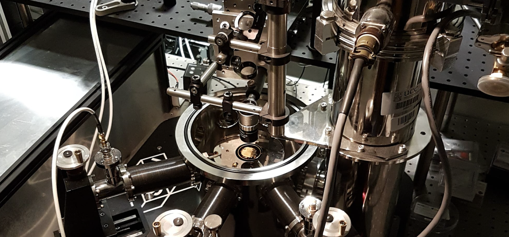
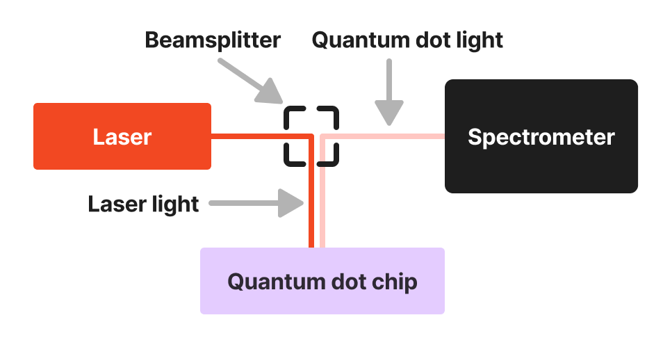

# Overview of Quantum Dots and the need for automation

This project addresses the challenge of automating the identification of
reliable Quantum Dots (QDs) for quantum research, focusing on reducing manual
effort in spectrum classification. QDs are nanoscale semiconductor particles
important for quantum computing applications, particularly in single-photon
generation. By leveraging classical data-science methods and variational
autoencoders, we aim to develop a classification pipeline with consistent
performance from minimal data, improving scalability and efficiency in QD
research. This framework has potential applications across fields that face
challenges with small datasets.

QDs are nanoscale semiconductor particles with quantum mechanical properties
like discrete energy levels. Their tunable characteristics make them useful for
optoelectronics, bioimaging, and quantum computing. At Tyndall, QDs are notably
important for generating single photons used in entanglement experiments, a
essential part of quantum technology development. Automating their
identification addresses scalability and resource challenges, enabling broader
experimentation and reducing manual labor in the research.

## Experimental Setup

>  _Figure: Lab bench where the chips are mounted and cooled to <10K._

QDs are made on a semiconductor chip, cooled, and studied under a microscope.
The experimental setup is outlined in the image above. A 650 nm red laser is
shone on the chip which excites electrons near the QD, which emit light as the
electron hole pairs captured inside the QD recombine. This light is captured
captured by the spectrometer where we see  sharp peaks on a wavelength vs.
intensity graph corresponding to states in the quantum dot. QDs can handle
multiple electron-hole pairs, resulting in several peaks (up to 20) on the
spectrometer graph.

>  _Figure: Simplified Lab Setup: the laser light excites
> states in the quantum dot which then themselves emit light which we collect on
> the spectrometer_

We then vary the laser power and take a spectrum at each power to create a power
dependence heatmap, this is our working piece of data for analysis.

## The Need for Automation

Measuring 50 heatmaps took 2.5 days in the lab; scaling to 500 would take nearly
a month, which highlights a need for automation to improve scalability, free up
resources, and enable more extensive experimentation. Note that the overall
research program at Tyndall involves measurements of thousands of QDs across
hundreds of chips. This manual process is slow and labor-intensive,  automation
data collection and analysis would free up lab time and allow for a greater
range of experiments.

The automation involves two phases:

__Automatic Spectrum Classification:__ Using 50 heatmaps, we plan to generate
synthetic data and train a classifier using variational autoencoders and
classical methods.

__Microscope and Data Collection Automation:__ This will address hardware and
data acquisition in a future project.

We propose using classical data-science methods and variational autoencoders to
classify spectra due to their ability to handle small datasets effectively and
capture complex patterns in the data. Compared to traditional rule-based or
purely statistical approaches, these methods offer flexibility and improved
accuracy by leveraging both structured feature engineering and representation
learning. Our goal is to both automate the lab experiments and publish a
scientific paper on the work. The quality of the publication and how ambitious
we can be with journal submission depends on the quality of the results and
interest to the community.

If we manage to create an automation pipeline with just 50 initial samples we
believe it would be of create interest to the wider community because we would
show that even with small data automation can be achieved with modern machine
learning techniques. 

